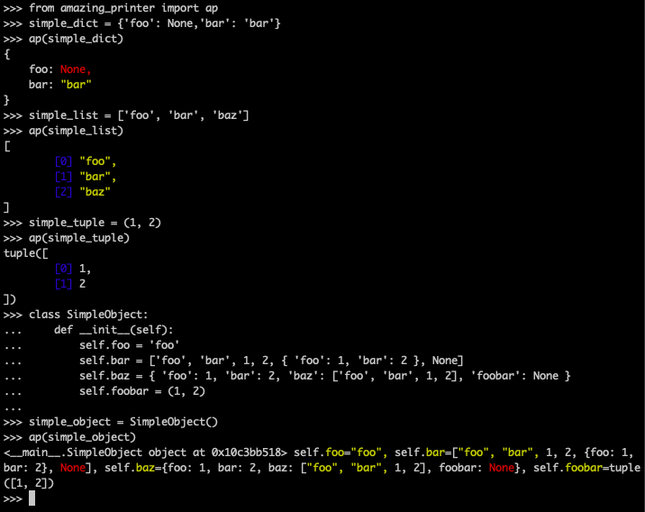

## Amazing Printer


 [](https://codecov.io/gh/tkbky/amazing_printer) [](https://pypi.org/project/amazing_printer/)

It's an attempt to port the Ruby's [awesome_print](https://github.com/awesome-print/awesome_print) to Python.



## Install

```sh
pip install amazing-printer
```

## Usage

```python
from amazing_printer import ap

ap(object, options = {})

# Options:
# sort_keys - boolean, set to sort the dictionary keys, default is False.
# indent - integer, set the width of indentation, default is 4 spaces.
# multiple_lines - boolean, set to print the fields for dict or list in multiple lines, default is True.
# color - dict, set the color for different literals, default is
# {
#     'str': 'yellow',
#     'list': 'blue',
#     'tuple': 'green',
#     'none': 'red',
# }
# supported colors: 'yellow', 'blue', 'green', 'red', 'black', 'magenta', 'cyan', 'white'
```

### Global Configuration

There are 2 ways to configure amazing printer globally.

1. Inside the code.

    ```python
    from amazing_printer import configure

    options = {
        "indent": 8,
    }

    configure(options)
    ```

2. From a config file.

    Name the config file as `.amazing_printer.yml` and place it inside the directory the python console is invoked or just your home directory (`~`).

    Example of the config file.

    ```yml
    sort_keys: false
    indent: 4
    index: true
    multiple_lines: true
    color:
      str: "red"
      list: "green"
      tuple: "blue"
      none: "yellow"
    ```

## Contributing

0. Fork & clone the repository
```sh
$ git clone git@github.com:<your-github-handle>/amazing_printer.git
$ cd amazing_printer
```

1. Create a virtual environment and activate it'
This project uses [Pipenv](https://github.com/pypa/pipenv). Follow the instruction [here](https://github.com/pypa/pipenv) to install.
```sh
$ pipenv shell --three
```

2. Install dependencies
```sh
# Install dependencies for development purpose.
$ pipenv install --dev
```

3. Make your awesome changes

4. Run test and coverage
```sh
# Run test
(env) $ pytest
# Run test with coverage report
(env) $ pytest --cov=amazing_printer amazing_printer/tests/
# Run specific test
(env) $ pytest -k "TestFormatter"
```

5. Run test for multiple environments
Make sure you have installed multiple versions of Python. Recommended way of managing Python version using [Pyenv](https://github.com/pyenv/pyenv)
```sh
(env) $ tox
```

6. Make your pull request

## License

Copyright (c) 2019 Kher Yee, Ting

Released under the MIT license. See [LICENSE](LICENSE) file for details.
